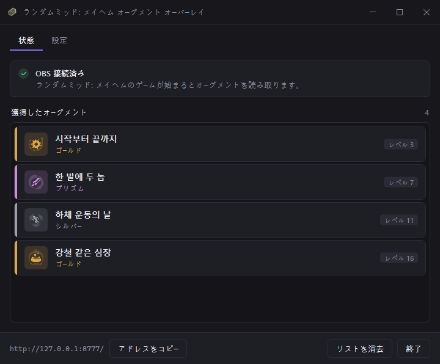
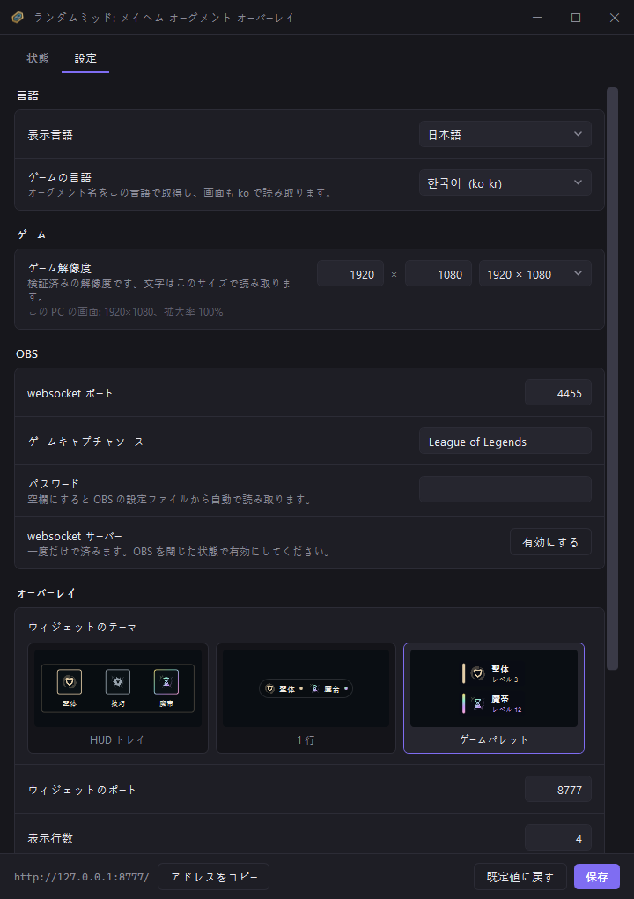

# ランダムミッド: メイヘム オーグメント オーバーレイ


[English](README.md) · [한국어](README.ko.md) · **日本語** · [简体中文](README.zh-CN.md)

[![CI][ci-badge]][ci-workflow]
[![release][release-badge]][releases]
[![downloads][downloads-badge]][releases]
[![stars][stars-badge]][stargazers]
[![forks][forks-badge]][network]

[ci-badge]: https://github.com/Finerestaurant/aram-augment-overlay/actions/workflows/ci.yml/badge.svg
[ci-workflow]: https://github.com/Finerestaurant/aram-augment-overlay/actions/workflows/ci.yml
[release-badge]: https://img.shields.io/github/v/release/Finerestaurant/aram-augment-overlay?include_prereleases
[downloads-badge]: https://img.shields.io/github/downloads/Finerestaurant/aram-augment-overlay/total
[stars-badge]: https://img.shields.io/github/stars/Finerestaurant/aram-augment-overlay
[forks-badge]: https://img.shields.io/github/forks/Finerestaurant/aram-augment-overlay
[releases]: https://github.com/Finerestaurant/aram-augment-overlay/releases
[stargazers]: https://github.com/Finerestaurant/aram-augment-overlay/stargazers
[network]: https://github.com/Finerestaurant/aram-augment-overlay/network/members

リーグ・オブ・レジェンドの **ランダムミッド: メイヘム** で獲得したオーグメントを、OBS の画面に積み上げて
表示するツールです。画面を読み取って認識するため、アカウント連携もログインも必要ありません。

[][releases]

- [ダウンロード](#ダウンロード)
- [最初に使うとき](#最初に使うとき)
  - [プログラムの画面](#プログラムの画面)
- [設定タブ](#設定タブ)
- [うまくいかないとき](#うまくいかないとき)
- [仕組み](#仕組み)
- [制限](#制限)
- [開発](#開発)
- [使っているもの](#使っているもの)
- [ライセンス](#ライセンス)


重視していること:

- **自動**: オーグメントを選ぶと数秒でリストに加わります。押すものはありません
- **軽量**: exe 1 つ。インストールも .NET ランタイムも不要です
- **非侵襲**: ゲームメモリは読まず、画面のピクセルだけを見ます。ゲームには何も残しません
- **匿名**: アカウント連携もログインも API キーもありません
- **透過**: 背景が空なので、そのまま配信画面に重なります

<table>
<tr>
<td width="40%"></td>
<td></td>
</tr>
<tr>
<td align="center"><sub>シルバー · ゴールド · プリズムを色分け</sub><br><sub>テーマ 3 種、配信中に切り替え可能</sub></td>
<td align="center"><sub>選ぶと数秒でリストに加わります</sub></td>
</tr>
</table>

> [!NOTE]
> 勝率やティアなどのパフォーマンス指標は、Riot のポリシー上表示しません。

ウィンドウは韓国語・英語・日本語・中国語に対応し、Windows の言語に従います（設定 → 表示言語で
変更できます）。ただし検出のしきい値は韓国語と英語のクライアントで測定したものです。[制限](#制限) を
参照してください。

## ダウンロード

[リリースページ][releases] から `ARAM-Augment-Overlay.exe` を 1 つ落とすだけです。

> [!IMPORTANT]
> 初回実行時に **「Windows によって PC が保護されました」** と表示されます。コード署名をしていない
> プログラムだからです。**詳細情報 → 実行** を押してください。

| 必要なもの | |
|---|---|
| OS | Windows 10 / 11 · 1920×1080 · 拡大率 100%。他の解像度は変換式はあるものの未検証 |
| OBS Studio | 28 以上 |
| ゲーム設定 | **ボーダーレスフルスクリーン**推奨 |
| OCR | クライアント言語に対応する Windows OCR 言語パック — アプリから導入できます |

## 最初に使うとき

**1. OBS の websocket サーバーを有効にする**

OBS を **一度起動** して、最初に出る自動構成ウィザードを閉じます。（ウィザードが開いている間、OBS は
設定ファイルを保存しません。）その後 **OBS を完全に終了** し、本プログラムを起動して
**設定**タブの **OBS websocket サーバーを有効化** を押します。OBS 内で
**ツール → WebSocket サーバー設定 → WebSocket サーバーを有効にする** としても同じです。

**2. 実行**

OBS を起動し直し、**状態**タブの **再試行** を押します。接続できるとインジケーターが
緑になり、ウィジェットのアドレスが表示されます。

ウィンドウの ✕ は終了ではなく **トレイに収納** します。トレイアイコンをダブルクリックするか、
プログラムをもう一度起動すると戻ります。本当に終了するには **終了** ボタン、または
トレイアイコンを右クリックして 終了 を選びます。

**3. OBS にウィジェットを追加**

**ソース → + → ブラウザ**

- URL: `http://127.0.0.1:8777/`
- サイズは何を入れても構いません — 実行中にカード幅と 4 行の高さへ自動調整されます
- **「シーンがアクティブになったときにブラウザを更新する」** の有効化を推奨

背景は透明なので、ゲーム画面にそのまま重なります。ゲームキャプチャソースはツールが自動で作ります。

### プログラムの画面

状態タブは接続状況とこれまでに獲得したオーグメントを表示し、設定タブで言語・解像度・OBS・オーバーレイを調整します。

| 状態 | 設定 |
|---|---|
|  |  |

## 設定タブ

変更内容は exe と同じ場所の `config.json` に保存され、**保存して再起動**で
反映されます。言語と座標は起動時に一度だけ読むため、再起動が必要です。

| 設定 | 何をするか |
|---|---|
| ゲームの言語 | リーグ クライアントの言語。オーグメント名をこの言語で取得し、画面もこの言語で読み取ります。対応する OCR 言語パックが無ければアプリから導入できます。初回はリーグのインストール先から読み取り、読めないときだけ Windows の表示言語を使います |
| ゲーム解像度 | OBS がゲーム画面のサイズを報告できないときに文字を読み取るサイズ。検証済みの値は 1920×1080 のみで、カード位置はどのサイズでも画面に合わせて追従します |
| OBS | websocket ポート · ゲームキャプチャソース名 · パスワード（空欄なら OBS の設定から自動取得） |
| ウィジェットのテーマ | HUD トレイ(横) · 1 行(最小) · ゲームパレット(縦)。変更は即座に反映され、ブラウザソースの更新は不要です |
| オーバーレイ | ウィジェットのポート · 表示行数 · 最大幅 |

<br><sub>HUD トレイ</sub>

<br><sub>1 行</sub>

<br><sub>ゲームパレット</sub>

コマンドライン引数も使えます。`--stop` は実行中のオーバーレイを正常終了させ（トレイアイコンも
片付けます）、`--widget-port` などは設定より優先されます。

## うまくいかないとき

**「OBS 未接続」**

OBS が起動しているか、websocket サーバーが有効か確認してください（設定タブのボタン）。OBS を
起動してから **再試行** を押せば済みます。ウィンドウを閉じ直す必要はありません。

**トレイにアイコンが溜まる**

タスクマネージャーで強制終了すると、アイコンを返却する機会がないまま死んだアイコンが残ります。
トレイの上をマウスが通れば Windows が片付けます。強制終了ではなく **終了** ボタンか `--stop` を
使ってください。

**OBS が「セーフモードで起動しますか?」と聞く**

必ず通常モードを選んでください。セーフモードは websocket を無効にするため接続できません。OBS が
異常終了した次の起動で表示されます。

**オーグメントを認識しない**

- ディスプレイの拡大率が 100% か確認
- ゲームが **ボーダーレスフルスクリーン** かフルスクリーンか確認
- ステータス行に **OBS にゲーム画面がありません** と出たら、ゲームキャプチャソースがゲームウィンドウを
  捉えていません。ツールが一度自動で直します。それでも直らなければ、ソースのウィンドウ一覧から
  「League of Legends (TM) Client」を選んでください

**別のオーグメントが表示された**

設定 › 詳細の **判定の記録を残す** を有効にしてプレイしてください。オーグメント選択画面が開いてから
閉じるまでがすべて保存され、`http://127.0.0.1:8777/inspect` でコマ送りできます。画面には検出が実際に
読んでいるすべてのボックスが描かれ、そのフレームの判定値がしきい値と並べて表示されます — リロール
ボタンのゲートスコア、カード明度、選択フレアの二つの判定、ツールチップのパネル、そしてリロールと
判定フレームを載せたタイムラインです。左右キーで 1 フレーム、Shift を押すと 10 フレーム動きます。

1 件あたり 15〜25MB なので既定はオフです。`state/inspect` に直近 8 件を保持し、古いものから削除します。

## 仕組み

オーグメントのデータは公式 API に **ありません。** Live Client Data API（`127.0.0.1:2999`）の
仕様を全て確認しましたがオーグメント関連のフィールドは一つもなく、マッチ API もメイヘムの対戦には
アクセスできません。そのため画面を読む方法しか残っていません。

1. Live Client Data API でメイヘムかどうか、現在のレベルを確認
2. OBS websocket でゲーム画面を受け取り、**リロールボタン 3 つをテンプレートマッチング** →
   オーグメント選択画面を検出
3. 選択の瞬間は画面が閉じるところから読む — 閉じる直前のカードの明るさとツールチップ
4. カード枠の色でレアリティを判定し、カードのタイトルを OCR
5. 読み取った名前をオーグメント一覧と照合して確定

明るさのしきい値ではなくテンプレートマッチングを使う理由、各しきい値の測定根拠、検証データは
[`docs/FINDINGS.md`](docs/FINDINGS.md)（韓国語）にまとめてあります。

## 制限

- **検証済みの解像度は 1920×1080 だけです。** 座標を測定した解像度であり、実際に対戦を回した
  唯一の解像度であり、設定が提示する唯一の値です。変換式自体はどのサイズでも動くように書かれ、
  計算は検証されています — クライアントはオーグメント画面を高さ基準で描き横方向は中央に置くため、
  1 台のモニターが提供する全画面解像度 15 種（16:9・16:10・5:4・4:3、1024×768〜1680×1050）で
  同じ選択画面をキャプチャして全て正しく読み取り、1440p・4K のリサンプルも加えて、いずれも
  自動テストで押さえてあります。ただし **それらの解像度で対戦したわけではありません。**
  21:9 以上のウルトラワイドはキャプチャすらなく、HUD スケールも試していません。
- 名前は OCR で読みます。読みが揺れてもオーグメント名の一覧と照合して補正しますが、まれに誤ることが
  あります。確定できなかった読みは記録しません。
- レアリティ判定と選択検出のしきい値は、実プレイとゲームプレイ映像から測定した値です。検証に使った
  シルバーの標本がまだ少なく、シルバーでは誤差が出ることがあります。
- ランダムミッド: メイヘム（`gameMode: KIWI`）でのみ動作します。
- **しきい値は韓国語と英語のクライアントで測定し、どちらも実際にプレイして確認しました。**
  日本語と中国語も設定で選べ、同じ測定値を使いますが、複数の対戦にわたる検証はしていません。

## 開発

```
dotnet build src/AramOverlay.slnx
dotnet run --project src/AramOverlay.SelfTest             # 突き合わせ検証
dotnet run --project src/AramOverlay.SelfTest -- --obs    # 起動中の OBS への接続確認
```

NuGet パッケージもネイティブ DLL も使わず、BCL と WinRT だけで動きます。OBS websocket は
`ClientWebSocket`、ウィジェットサーバーは `HttpListener`、OCR は `Windows.Media.Ocr`、画像デコードは
`Windows.Graphics.Imaging`、OpenCV が担っていた 4 つの処理は `Cv.cs` に自前で実装しています。

このツールは元々 Python で作られ、C# へ移植しました。どこまで完全に一致させられ、どこからは原理的に
不可能だったかは [`docs/PORTING.md`](docs/PORTING.md)（韓国語）にあります。`tests/` の突き合わせ
データは当時の Python 実装が出した値で、作り直すには `scripts/gen_*.py` とコミット `ecd9cb5`
以前の Python コードが必要です。

<details>
<summary>配布用ビルドとリリース</summary>

```
dotnet publish src/AramOverlay.App -c Release -r win-x64 --self-contained true ^
  -p:PublishSingleFile=true -p:IncludeNativeLibrariesForSelfExtract=true ^
  -p:EnableCompressionInSingleFile=true -p:DebugType=none -o publish
```

タグを push すると GitHub Actions がビルドしてリリースを公開します。

```
git tag v0.1.0 && git push origin v0.1.0
```

</details>

## 使っているもの

- オーグメントデータ: [CommunityDragon](https://www.communitydragon.org/)
- OCR: Windows 内蔵の OCR エンジン（Windows.Media.Ocr）
- OBS 連携: [obs-websocket](https://github.com/obsproject/obs-websocket)

League of Legends は Riot Games, Inc. の商標です。本プロジェクトは Riot Games とは無関係です。

## ライセンス

MIT
