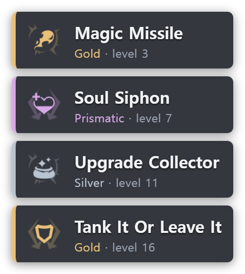
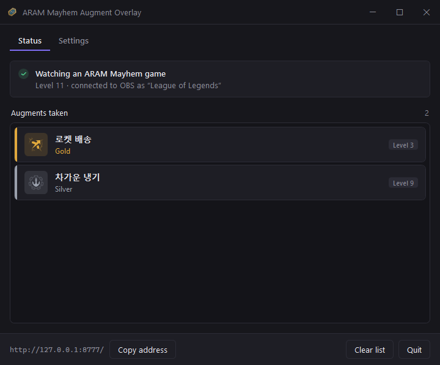
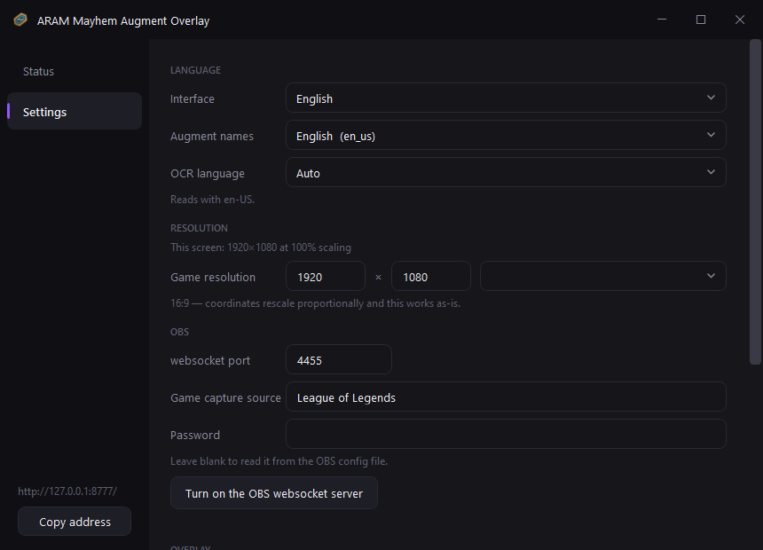

# 아수라장 증강 오버레이


[English](README.md) · **한국어** · [日本語](README.ja.md) · [简体中文](README.zh-CN.md)

[![CI][ci-badge]][ci-workflow]
[![release][release-badge]][releases]
[![downloads][downloads-badge]][releases]
[![stars][stars-badge]][stargazers]
[![forks][forks-badge]][network]

[ci-badge]: https://github.com/Finerestaurant/aram-augment-overlay/actions/workflows/ci.yml/badge.svg
[ci-workflow]: https://github.com/Finerestaurant/aram-augment-overlay/actions/workflows/ci.yml
[release-badge]: https://img.shields.io/github/v/release/Finerestaurant/aram-augment-overlay?include_prereleases
[downloads-badge]: https://img.shields.io/github/downloads/Finerestaurant/aram-augment-overlay/total
[stars-badge]: https://img.shields.io/github/stars/Finerestaurant/aram-augment-overlay
[forks-badge]: https://img.shields.io/github/forks/Finerestaurant/aram-augment-overlay
[releases]: https://github.com/Finerestaurant/aram-augment-overlay/releases
[stargazers]: https://github.com/Finerestaurant/aram-augment-overlay/stargazers
[network]: https://github.com/Finerestaurant/aram-augment-overlay/network/members

리그 오브 레전드 **무작위 총력전: 아수라장**에서 획득한 증강을 방송 화면에 누적 표시하는 OBS
오버레이입니다. 게임 화면을 읽어서 증강을 인식하므로 계정 연동이나 로그인이 필요 없습니다.

[][releases]

- [받기](#받기)
- [처음 쓰실 때](#처음-쓰실-때)
  - [프로그램 화면](#프로그램-화면)
- [설정 탭](#설정-탭)
- [잘 안 될 때](#잘-안-될-때)
- [동작 원리](#동작-원리)
- [한계](#한계)
- [개발](#개발)
- [쓴 것들](#쓴-것들)
- [라이선스](#라이선스)


이 도구가 지키는 것:

- **자동**: 증강을 고르면 몇 초 안에 목록에 쌓입니다. 누를 것이 없습니다
- **가벼움**: exe 하나. 설치 과정도, .NET 런타임도 필요 없습니다
- **무간섭**: 게임 메모리를 읽지 않고 화면 픽셀만 봅니다. 게임에 아무것도 남기지 않습니다
- **익명**: 계정 연동도, 로그인도, API 키도 없습니다
- **투명**: 배경이 비어 있어 방송 화면 위에 그대로 겹칩니다

<table>
<tr>
<td width="40%"></td>
<td></td>
</tr>
<tr>
<td align="center"><sub>실버 · 골드 · 프리즘을 색으로 구분</sub></td>
<td align="center"><sub>증강을 고르면 몇 초 안에 쌓입니다</sub></td>
</tr>
</table>

> [!NOTE]
> 승률·티어 등 성능 지표는 라이엇 정책상 표시하지 않습니다.

## 받기

[릴리스 페이지][releases]에서 `ARAM-Augment-Overlay.exe` 하나만 받으면 됩니다.

> [!IMPORTANT]
> 처음 실행할 때 **"Windows에서 PC를 보호했습니다"** 경고가 뜹니다. 코드 서명을 하지 않은
> 프로그램이라 그런 것이고, **추가 정보 → 실행**을 누르면 됩니다.

| 필요한 것 | |
|---|---|
| OS | Windows 10 / 11, **1920×1080 해상도, 배율 100%** |
| OBS Studio | 28 이상 |
| 게임 설정 | **테두리 없는 전체화면** 권장 |
| OCR | 클라이언트 언어에 맞는 Windows OCR 언어 팩 — 없으면 프로그램이 설치해 줍니다 |

## 처음 쓰실 때

**1. OBS websocket 켜기**

OBS를 **한 번 실행**하고 처음 뜨는 자동 구성 마법사를 닫습니다. (마법사가 떠 있는 동안에는 OBS가
설정 파일을 저장하지 않습니다.) 그다음 **OBS를 완전히 종료**하고, 이 프로그램을 실행해
**설정 탭 → OBS websocket 서버 켜기**를 누릅니다. OBS 안에서 직접
**도구 → WebSocket 서버 설정 → 서버 활성화**를 해도 같습니다.

**2. 실행**

OBS를 다시 실행한 뒤 상태 탭의 **다시 시도**를 누릅니다. 연결되면 표시등이 초록으로 바뀌고
위젯 주소가 나옵니다.

창의 ✕ 는 종료가 아니라 **트레이로 내려갑니다**. 트레이 아이콘을 두 번 누르거나 프로그램을 다시
실행하면 창이 돌아옵니다. 실제로 끄려면 **종료** 버튼이나 트레이 우클릭 → 종료를 쓰세요.

**3. OBS에 위젯 붙이기**

**소스 → + → 브라우저**

- URL: `http://127.0.0.1:8777/`
- 크기는 아무 값이나 넣어도 됩니다 — 실행 중에 증강 카드 폭과 4행 높이에 맞춰 자동 조정됩니다
- **"장면이 활성화될 때 브라우저 새로고침"** 체크 권장

배경은 투명하므로 게임 화면 위에 그대로 겹칩니다. 게임 캡처 소스는 도구가 자동으로 만듭니다.

### 프로그램 화면

상태 탭은 연결 상태와 지금까지 획득한 증강을 보여주고, 설정 탭에서 언어·해상도·OBS·오버레이를 조정합니다.

| 상태 | 설정 |
|---|---|
|  |  |

## 설정 탭

바꾼 값은 exe 옆 `config.json`에 저장되고, **저장하고 다시 시작**을 누르면 반영됩니다.
(언어와 좌표는 시작할 때 한 번 읽으므로 재시작이 필요합니다.)

| 설정 | 하는 일 |
|---|---|
| 게임 언어 | 리그 클라이언트의 언어. 증강 이름을 이 언어로 받아오고 화면도 이 언어로 읽습니다. 해당 OCR 언어 팩이 없으면 바로 설치할 수 있습니다 |
| 게임 해상도 | 좌표를 이 해상도에 맞춰 환산합니다. 16:9면 그대로 동작하고, 아니면 경고가 뜹니다 |
| OBS | websocket 포트 · 게임 캡처 소스 이름 · 비밀번호 (비우면 OBS 설정에서 자동) |
| 오버레이 | 위젯 포트 · 표시 행 수 · 최대 폭 |

명령줄 인자도 받습니다. `--stop` 은 실행 중인 오버레이를 정상 종료하고(트레이 아이콘까지 정리),
`--widget-port` 등은 설정보다 우선합니다.

## 잘 안 될 때

**"OBS 연결 안 됨"**

OBS가 실행 중인지, websocket 서버가 켜져 있는지 확인하세요(설정 탭의 버튼). OBS를 켠 다음
상태 탭의 **다시 시도**를 누르면 됩니다 — 창을 닫았다 열 필요 없습니다.

**트레이에 아이콘이 여러 개 쌓임**

작업 관리자로 강제 종료하면 프로그램이 아이콘을 반납하지 못해 죽은 아이콘이 남습니다. 트레이 위로
마우스를 한 번 지나가면 윈도우가 알아서 치웁니다. 강제 종료 대신 **종료** 버튼이나 `--stop` 을
쓰세요.

**OBS를 켰더니 "안전 모드로 실행하시겠습니까?"**

반드시 **일반 모드로 실행**을 고르세요. 안전 모드는 websocket을 끄기 때문에 도구가 연결하지
못합니다. OBS가 비정상 종료된 다음 실행에서 나타납니다.

**증강을 인식하지 못함**

- 해상도가 1920×1080, 배율 100%인지 확인
- 게임이 **테두리 없는 전체화면**인지 확인
- OBS 게임 캡처 소스가 실제로 게임을 잡고 있는지 미리보기로 확인

## 동작 원리

증강 데이터는 공식 API에 **없습니다.** Live Client Data API(`127.0.0.1:2999`)의 스펙 전문을
확인했지만 증강 관련 필드가 하나도 없고, 매치 API도 아수라장 대전에는 접근이 막혀 있습니다.
그래서 화면을 읽는 방식이 유일한 경로입니다.

1. Live Client Data API로 아수라장 게임인지, 현재 레벨이 몇인지 확인
2. OBS websocket으로 게임 화면을 받아 **리롤 버튼 3개를 템플릿 매칭** → 증강 선택창 감지
3. 선택 순간 감지 — 창이 닫히기 직전 카드 밝기와 툴팁 판독
4. 카드 테두리 색으로 등급 판별, 카드 제목을 OCR
5. 읽은 이름을 증강 목록과 대조해 확정

밝기 임계값 대신 템플릿 매칭을 쓰는 이유, 각 임계값의 측정 근거, 검증 데이터는
[`docs/FINDINGS.md`](docs/FINDINGS.md)에 정리돼 있습니다.

## 한계

- 좌표는 1920×1080 기준으로 측정했고, 설정에서 지정한 해상도에 맞춰 **비율로 환산**됩니다.
  16:9라면 다른 해상도에서도 같은 배치로 떨어지지만, 실제로 검증한 것은 1920×1080뿐입니다.
- 증강 이름은 OCR로 읽습니다. 인식이 흔들려도 증강 이름 목록과 대조해 보정하지만, 드물게 틀릴 수
  있습니다. 인식에 실패하면 기록하지 않습니다.
- 등급 판별과 선택 감지 임계값은 실제 플레이와 게임플레이 영상에서 측정한 값입니다. 검증에 쓴 실버
  등급 표본이 아직 적어, 실버에서 오차가 있을 수 있습니다.
- 아수라장(`gameMode: KIWI`)에서만 동작합니다.
- **임계값은 한국어 클라이언트에서 측정했습니다.** 설정에서 다른 언어도 고를 수 있고 테스트에서
  영어도 깨끗하게 읽혔지만, 한국어 외에는 여러 판에 걸친 검증을 하지 않았습니다.

## 개발

```
dotnet build src/AramOverlay.slnx
dotnet run --project src/AramOverlay.SelfTest            # 대조 검증
dotnet run --project src/AramOverlay.SelfTest -- --obs   # 실행 중인 OBS로 연결 확인
```

NuGet 패키지와 네이티브 DLL 없이 BCL과 WinRT만 씁니다. OBS websocket은 `ClientWebSocket`,
위젯 서버는 `HttpListener`, OCR은 `Windows.Media.Ocr`, 이미지 디코딩은
`Windows.Graphics.Imaging`이고, OpenCV가 하던 네 가지 연산은 `Cv.cs`에 직접 구현했습니다.

이 도구는 원래 파이썬으로 만들었고 C#으로 옮겼습니다. 무엇을 어디까지 똑같이 맞출 수 있었고
어디부터는 원리적으로 불가능했는지는 [`docs/PORTING.md`](docs/PORTING.md)에 있습니다.
`tests/` 의 대조 데이터는 그때 파이썬 구현이 낸 값이며, 다시 만들려면
`scripts/gen_*.py` 와 커밋 `ecd9cb5` 이전의 파이썬 코드가 필요합니다.

<details>
<summary>배포용 빌드와 릴리스</summary>

```
dotnet publish src/AramOverlay.App -c Release -r win-x64 --self-contained true ^
  -p:PublishSingleFile=true -p:IncludeNativeLibrariesForSelfExtract=true ^
  -p:EnableCompressionInSingleFile=true -p:DebugType=none -o publish
```

릴리스는 태그를 밀면 GitHub Actions가 빌드해 올립니다.

```
git tag v0.1.0 && git push origin v0.1.0
```

</details>

## 쓴 것들

- 증강 데이터: [CommunityDragon](https://www.communitydragon.org/)
- OCR: Windows 내장 OCR 엔진 (Windows.Media.Ocr)
- OBS 연동: [obs-websocket](https://github.com/obsproject/obs-websocket)

League of Legends는 Riot Games, Inc.의 상표입니다. 이 프로젝트는 Riot Games와 무관합니다.

## 라이선스

MIT
