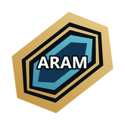
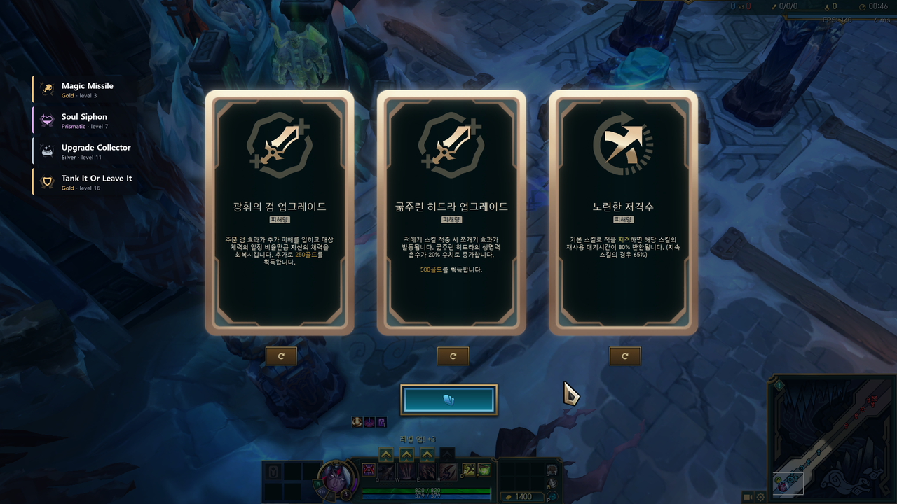
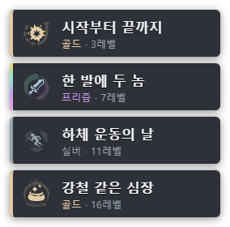
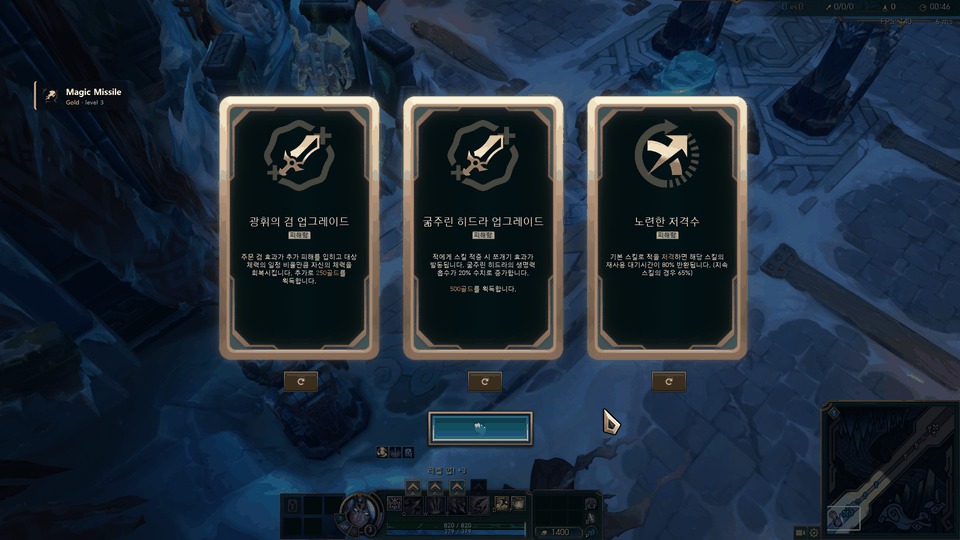
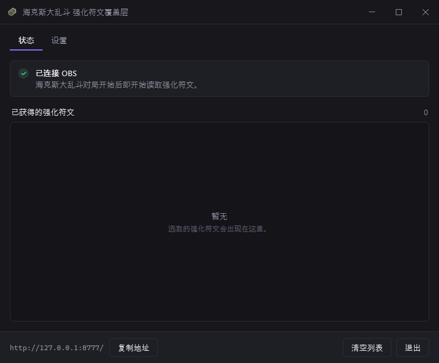
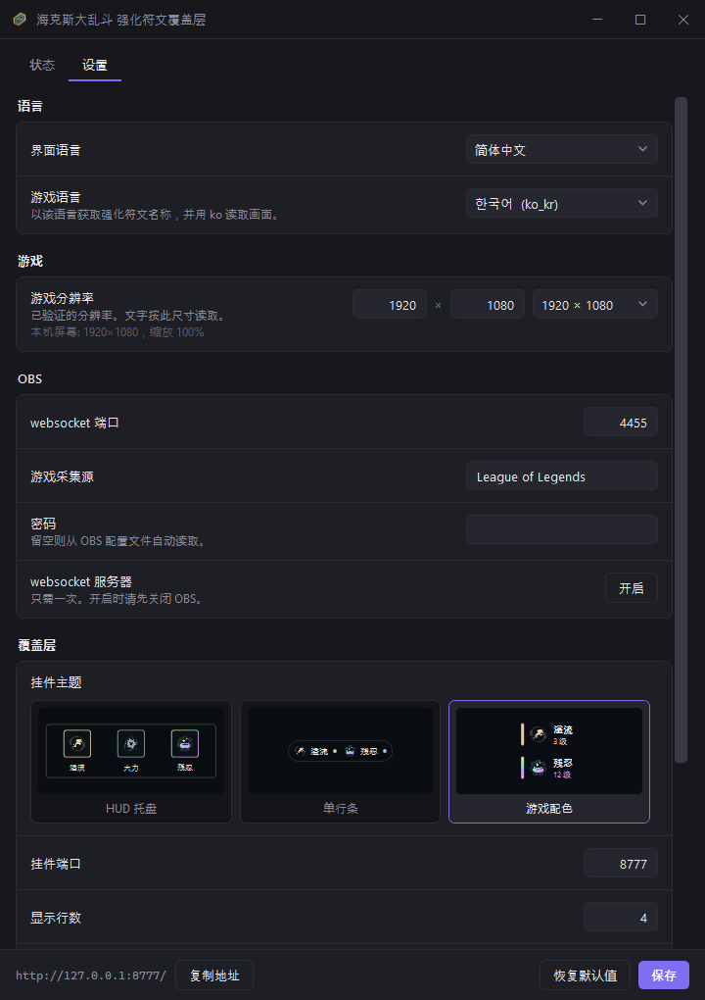
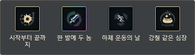
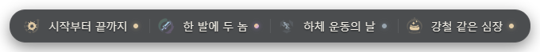

# 海克斯大乱斗 强化符文覆盖层



[English](README.md) · [한국어](README.ko.md) · [日本語](README.ja.md) · **简体中文**

[![CI][ci-badge]][ci-workflow]
[![release][release-badge]][releases]
[![downloads][downloads-badge]][releases]
[![stars][stars-badge]][stargazers]
[![forks][forks-badge]][network]

[ci-badge]: https://github.com/Finerestaurant/aram-augment-overlay/actions/workflows/ci.yml/badge.svg
[ci-workflow]: https://github.com/Finerestaurant/aram-augment-overlay/actions/workflows/ci.yml
[release-badge]: https://img.shields.io/github/v/release/Finerestaurant/aram-augment-overlay?include_prereleases
[downloads-badge]: https://img.shields.io/github/downloads/Finerestaurant/aram-augment-overlay/total
[stars-badge]: https://img.shields.io/github/stars/Finerestaurant/aram-augment-overlay
[forks-badge]: https://img.shields.io/github/forks/Finerestaurant/aram-augment-overlay
[releases]: https://github.com/Finerestaurant/aram-augment-overlay/releases
[stargazers]: https://github.com/Finerestaurant/aram-augment-overlay/stargazers
[network]: https://github.com/Finerestaurant/aram-augment-overlay/network/members

把你在英雄联盟 **海克斯大乱斗** 中获得的强化符文，累计显示在 OBS 画面上。它靠读取游戏画面
来识别，因此不需要绑定账号，也不需要登录。

[][releases]

- [下载](#下载)
- [首次使用](#首次使用)
  - [程序界面](#程序界面)
- [设置标签页](#设置标签页)
- [出问题时](#出问题时)
- [工作原理](#工作原理)
- [局限](#局限)
- [开发](#开发)
- [依赖](#依赖)
- [许可证](#许可证)



它专注于:

- **自动**：每次获得强化符文，几秒内就会加入列表，不用按任何东西
- **轻量**：只有一个 exe，没有安装步骤，连 .NET 运行时都不需要
- **无侵入**：只看屏幕像素，从不读取游戏内存，也不在游戏里留下任何东西
- **匿名**：不绑定账号，不登录，不需要 API 密钥
- **透明**：背景是空的，可直接叠在直播画面上

<table>
<tr>
<td width="40%"></td>
<td></td>
</tr>
<tr>
<td align="center"><sub>白银 · 黄金 · 棱彩用颜色区分</sub><br><sub>三种主题，直播中即时切换</sub></td>
<td align="center"><sub>获得后几秒内加入列表</sub></td>
</tr>
</table>

> [!NOTE]
> 胜率、段位等表现数据不会显示 —— 拳头的政策不允许。

界面支持韩语、英语、日语和简体中文，会跟随 Windows 的语言，也可在 设置 → 界面语言 中更改。
不过检测阈值是在韩语和英语客户端上测得的，参见[局限](#局限)。

## 下载

在[发布页面][releases]下载单个 `ARAM-Augment-Overlay.exe` 即可。

> [!IMPORTANT]
> 首次运行时 Windows 会提示 **“Windows 已保护你的电脑”**。这是因为程序没有做代码签名。点击
> **更多信息 → 仍要运行**。

| 需要什么 | |
|---|---|
| 操作系统 | Windows 10 / 11 · 1920×1080 · 缩放 100%。其他分辨率有映射公式但未验证 |
| OBS Studio | 28 或更新 |
| 游戏设置 | 建议**无边框全屏** |
| OCR | 与客户端语言对应的 Windows OCR 语言包 — 可由程序代为安装 |

## 首次使用

**1. 打开 OBS 的 websocket 服务器**

先**启动一次 OBS**，关掉首次出现的自动配置向导。（向导开着时 OBS 根本不会保存配置文件。）然后
**完全退出 OBS**，运行本程序，在**设置**标签页点击 **打开 OBS websocket 服务器**。在 OBS 里
通过**工具 → WebSocket 服务器设置 → 启用 WebSocket 服务器**操作是等效的。

**2. 运行**

重新启动 OBS，在**状态**标签页点击 **重试**。连接成功后指示灯变绿，并显示挂件
地址。

窗口的 ✕ 不是退出，而是**收进托盘**。双击托盘图标，或再次启动程序，窗口就会回来。真正要关闭请用
**退出**按钮，或右键托盘图标选择 退出。

**3. 在 OBS 中添加挂件**

**来源 → + → 浏览器**

- URL：`http://127.0.0.1:8777/`
- 尺寸随便填 —— 运行时会自动调整到卡片宽度和 4 行的高度
- 建议勾选**“场景激活时刷新浏览器”**

背景是透明的，因此会直接叠在游戏画面上。游戏采集源由工具自动创建。

### 程序界面

状态标签页显示连接情况与已获得的强化符文；设置标签页用于调整语言、分辨率、OBS 和覆盖层。

| 状态 | 设置 |
|---|---|
|  |  |

## 设置标签页

改动会写入 exe 旁边的 `config.json`，点击 **保存并重启**后生效。语言和坐标
在启动时只读取一次，所以需要重启。

| 设置 | 作用 |
|---|---|
| 游戏语言 | 英雄联盟客户端的语言。以该语言获取强化符文名称，并用该语言读取画面。缺少对应的 OCR 语言包时，程序可以直接安装。首次运行时从英雄联盟安装目录读取，读不到时才用 Windows 的显示语言 |
| 游戏分辨率 | OBS 无法报告游戏画面尺寸时用于读取文字的尺寸。已验证的只有 1920×1080，卡片位置在任意尺寸下都会跟随画面 |
| OBS | websocket 端口 · 游戏采集源名称 · 密码（留空则从 OBS 配置自动读取） |
| 挂件主题 | HUD 托盘（横向） · 单行条（最小） · 游戏配色（纵向）。修改立即生效，无需刷新浏览器源 |
| 覆盖层 | 挂件端口 · 显示行数 · 最大宽度 |

<br><sub>HUD 托盘</sub>

<br><sub>单行条</sub>

<br><sub>游戏配色</sub>

也支持命令行参数。`--stop` 会让正在运行的覆盖层正常退出（同时清理托盘图标），`--widget-port`
之类的参数优先于已保存的设置。

## 出问题时

**“未连接 OBS”**

确认 OBS 正在运行，且 websocket 服务器已打开（设置标签页的按钮）。启动 OBS 后按
**重试**即可，不必关掉窗口重开。

**托盘里图标越积越多**

用任务管理器强制结束会让程序没有机会收回图标，于是留下死图标。鼠标从托盘上划过，Windows 就会清理
掉。请用**退出**按钮或 `--stop`，不要强制结束。

**OBS 询问“是否以安全模式启动？”**

一定要选普通模式。安全模式会关闭 websocket，工具就连不上了。这个提示出现在 OBS 异常退出之后的
下一次启动。

**识别不到强化符文**

- 确认显示缩放为 100%
- 确认游戏处于**无边框全屏**或全屏
- 如果状态行显示**OBS 中没有游戏画面**，说明游戏采集源没有对准游戏窗口。工具会自行修正一次；若仍无效，
  请在该来源的窗口列表中选择“League of Legends (TM) Client”

**发布了错误的强化符文**

在设置 › 高级中打开**记录每次判定过程**后再游戏。强化符文选择界面从打开到关闭的全过程都会被保存，可在
`http://127.0.0.1:8777/inspect` 中逐帧回看。画面上会绘制检测实际读取的所有区域，并在旁边列出该帧的判定
值与对应阈值 — 重掷按钮的门限分数、卡片亮度、选中闪光的两项判定、提示框面板，以及标出重掷与判定帧的
时间轴。左右方向键移动一帧，按住 Shift 移动十帧。

单个窗口约 15~25MB，因此默认关闭。`state/inspect` 中保留最近 8 次，并从最旧的开始删除。

## 工作原理

强化符文数据**不在**任何官方 API 里。Live Client Data API（`127.0.0.1:2999`）的完整规范都查过了，
没有任何与强化符文相关的字段，对局 API 也对海克斯大乱斗关闭。因此读屏是唯一可行的路径。

1. 通过 Live Client Data API 确认是否为海克斯大乱斗对局，以及当前等级
2. 通过 OBS websocket 取得游戏画面，**对 3 个刷新按钮做模板匹配** → 检测强化符文选择界面
3. 选择的瞬间从界面关闭处读出 —— 关闭前一刻的卡片亮度与提示框
4. 用卡片边框颜色判定品质，用 OCR 读取卡片标题
5. 把读到的名称与强化符文名单比对后确定

为什么用模板匹配而不是亮度阈值、各阈值的测量依据、验证数据，都整理在
[`docs/FINDINGS.md`](docs/FINDINGS.md)（韩语）里。

## 局限

- **仅验证过 1920×1080。** 它是测量坐标时使用的分辨率，是唯一跑过真实对局的分辨率，也是设置中
  提供的唯一选项。映射公式本身按任意尺寸都能工作来编写，且计算已被验证 —— 客户端按高度绘制
  强化符文界面并水平居中，因此在一台显示器提供的全部 15 种全屏分辨率（16:9、16:10、5:4、4:3，
  从 1024×768 到 1680×1050）下捕获同一个选择界面均能正确读取，再加上 1440p 和 4K 重采样，
  两者都由自动测试守着。但**这并不等于在那些分辨率下打过对局。** 21:9 及更宽的屏幕连捕获都没有，
  HUD 缩放也未曾尝试。
- 名称靠 OCR 读取。读得不稳时会与强化符文名单比对来纠正，但仍可能偶尔出错。无法确认的读取结果不会
  被记录。
- 品质判定和选择检测的阈值来自真实对局与游戏录像的测量。用于验证的白银样本还很少，白银可能不够
  可靠。
- 仅在海克斯大乱斗（`gameMode: KIWI`）下工作。
- **阈值是在韩语和英语客户端上测得的，两者都实际游玩验证过。** 日语和中文也可以在设置里选择，
  并使用相同的测量值，但都没有经过多局验证。

## 开发

```
dotnet build src/AramOverlay.slnx
dotnet run --project src/AramOverlay.SelfTest             # 一致性验证
dotnet run --project src/AramOverlay.SelfTest -- --obs    # 对正在运行的 OBS 做连接检查
```

不用 NuGet 包，也不用原生 DLL，只用 BCL 和 WinRT。OBS websocket 用 `ClientWebSocket`，挂件服务器
用 `HttpListener`，OCR 用 `Windows.Media.Ocr`，图像解码用 `Windows.Graphics.Imaging`，OpenCV 原本
承担的四项运算在 `Cv.cs` 中自行实现。

这个工具最初用 Python 编写，后来移植到 C#。哪些能做到完全一致、哪些在原理上不可能，都写在
[`docs/PORTING.md`](docs/PORTING.md)（韩语）里。`tests/` 下的比对数据是当时 Python 实现产出的；
要重新生成，需要 `scripts/gen_*.py` 以及提交 `ecd9cb5` 之前的 Python 代码。

<details>
<summary>发布构建与发版</summary>

```
dotnet publish src/AramOverlay.App -c Release -r win-x64 --self-contained true ^
  -p:PublishSingleFile=true -p:IncludeNativeLibrariesForSelfExtract=true ^
  -p:EnableCompressionInSingleFile=true -p:DebugType=none -o publish
```

推送标签后 GitHub Actions 会构建并发布。

```
git tag v0.1.0 && git push origin v0.1.0
```

</details>

## 依赖

- 强化符文数据：[CommunityDragon](https://www.communitydragon.org/)
- OCR：Windows 内置 OCR 引擎（Windows.Media.Ocr）
- OBS 联动：[obs-websocket](https://github.com/obsproject/obs-websocket)

League of Legends 是 Riot Games, Inc. 的商标。本项目与 Riot Games 无关。

## 许可证

MIT
